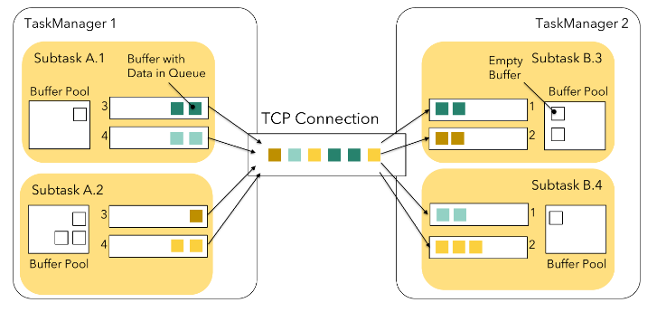

# 深入理解Flink网络栈

_本文翻译自博客[《A Deep-Dive into Flink's Network Stack》](https://flink.apache.org/2019/06/05/flink-network-stack.html)_

Flink 的网络栈是flink-runtime模块的一个核心组件，在Flink作业中起到至关重要的作用。它连接所有TaskManager上的独立工作单元(subtasks)。数据流通过Flink网络栈在task之间传递，因此Flink网络栈对于作业的吞吐量和延迟起者关键的作用。不同于TaskManager和JobManager之间协作通道使用的基于Akka的RPC通信，TaskManger之间的网络栈使用的是更加底层的基于Netty的API。


在下面的章节中，首先概括介绍暴露给流操作算子的抽象， 然后深入介绍实现细节和Flink所做的诸多优化，简要介绍这些优化的结果以及Flink在吞吐量和延迟之间的权衡。

## 逻辑视图

Flink 的网络栈对于子任务（subtask）之间相互通信提供了如下的逻辑视图，例如在网络Task A 通过keyBy()方法与Task B之间的数据shuffle。


这个过程通过下面三个概念的不同设定来进行抽象：

- 子任务输出类型 (ResultPartitionType):
    
    - piplined(有界或无界)：只要有数据产生就往下游发送。
    - blocking：只有当整个结果都产生完了才会往下游发送。
    
- 调度类型：

    - 一次性全部调度(eager)：同时部署所有子任务(用于streaming应用)。
    - 产生第一条输出时调度下游任务(lazy)：当上游任务产生第一条输出时部署对应下游任务。
    - 产生完整输出时调度下游任务： 当上游任意或所有任务产生完整的输出时部署对应下游任务。
    
- 传输方式：
    
    - 高吞吐：Flink缓存一批数据到网络缓存中，批量发送，减少了每条数据发送带来的开销。
    - 使用缓存超时实现低延迟：通过减小缓存超时时间，提前发送不满的缓存，降低延迟，但可能会牺牲吞吐量。
      

在这里，进一步说明输出类型和调度类型， 首先应该知道，输出类型和调度类型是紧密交织在一起的，只有特定的这两者的组合是有效的。

piplined输出的结果分区是流式的，它需要一个可用的目标子任务来发送数据，这个目标子任务可以在结果生成之前或者在第一条输出产生时被调度。批处理作业产生有界的结果分区而流处理作业产生无界的结果分区。
批处理作业还可能以一种阻塞的方式生成结果，这依赖于使用的算子和连接方式。这种情况下在接收数据的子任务可以被调度之前，发送数据的子任务必须先产生完整的结果。这种方式使得批处理作业更加高效，并且使用的资源更少。

下表概括了输出类型和调度类型的有效的组合。


1： 当前在Flink中没有使用。
2： 实现批流统一之后可能会应用于流作业。

另外，对于有多个输入的子任务，有两种方式的调度：所有输入都生成一条数据或完整的数据集、任意输入产生一条数据或完整的数据集。批处理作业的输出类型和调度类型的调节可以参考 ExecutionConfig#setExecutionMode()和ExecutionMode，或者ExecutionConfig#setDefaultInputDependencyConstraint()。


## 物理传输


为了理解物理上的数据连接， 回顾一下，在Flink中不同的任务可以通过slot sharing group共享同一个slot。TaskManger也可以提供多个slot来允许同一个任务的多个子任务调度到同一个TaskManager。
如下图，我们假设任务的并行度是4，并且部署的方式是2个TaskManager上分别提供2个slot。TaskManager 1执行子任务A.1，A.2，B.1，B.2，TaskManager 2执行A.3，A.4，B.3，B.4。
task A和 task B以shuffle方式连接， 那么在每个TaskManager上游2*4个逻辑连接，其中一些事本地连接，另外一些为远程连接。


Flink的网络栈中不同任务间的每个（远程）网络连接用于自己的TCP通道。然而，如果不同的子任务被调度到了同一个TaskManager，它们同相同的TaskManager的连接将会被复用，并且共享同一个TCP连接。在我们的例子当中，这用方式应用于A.1 → B.3, A.1 → B.4 以及 A.2 → B.3, and A.2 → B.4的连接中，如下图所示




每个子任务的结果称为ResultPartition，每个ResultPartition又分成多个ResultSubpartitions，每个逻辑通道对应一个ResultSubpartition
这个时候， Flink不再处理每个单独的record，而是一组序列化在网络缓存中的聚集到一起的序列化的record。
每个子任务的本地缓存池(发送端和接收端各有一个)中的可用缓存数量上限为
```
#channels * buffers-per-channel + floating-buffers-per-gate
```

一个TaskManager上的总的缓存数量通常不需要配置，如果需要可以参考[Configuring the Network Buffers](https://ci.apache.org/projects/flink/flink-docs-release-1.8/ops/config.html#configuring-the-network-buffers)

### 面临反压 (1)

当一个子任务的发送缓存池耗尽的时候 - 缓存停留在ResultSubPartition的缓存队列中或者更底层的Netty的网络栈中，这时生成这就会阻塞，出现反压。
接收端也是类似的：任何接收的Netty网络栈缓存都需要放到Flink的网络缓存中。如果子任务的缓存池中没有可用的网络缓存，Flink将会停止从连接中读取数据，直到有缓存可用
者会使得所有复用该连接的发送中的子任务也出现反压，并且其他接收端子任务也会因此受到压制。下图说明了这一点，对于一个过载的子任务B.4，它会引起复用通道上的反压，并且使得B.3也会停止数据的接收和处理，尽管B.3还有多余的容量。


为了防止这种情况发生，Flink引入了它的流控机制

##Credit-based流控

